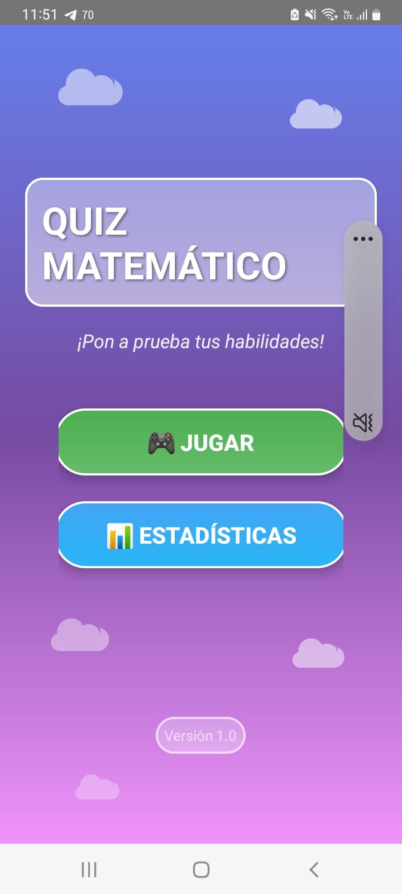
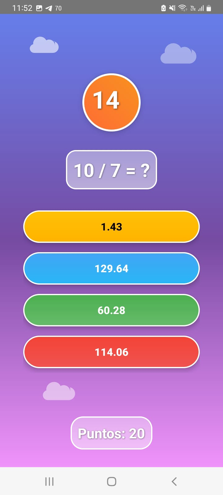
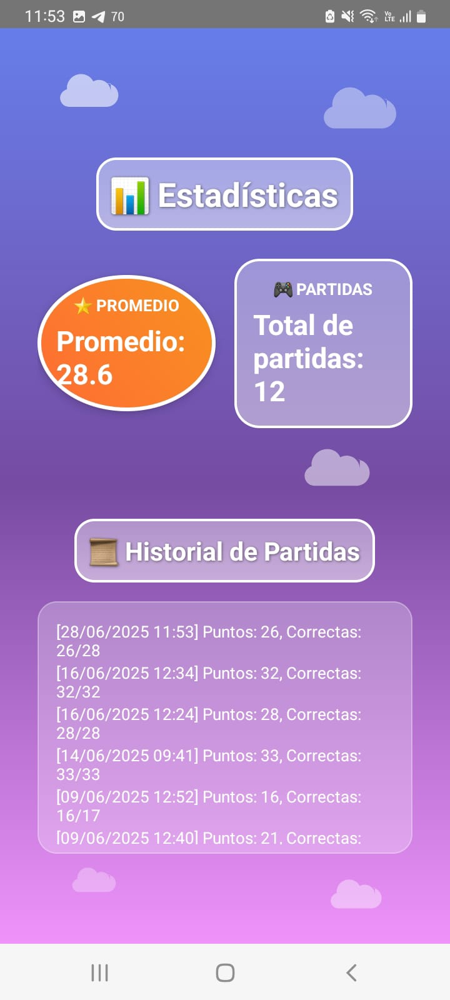

````markdown
# 📱 MathTrainer: Entrenador de Matemáticas Rápidas

**Curso:** Programación para Dispositivos Móviles  
**Semestre:** VI  
**Autor:** Diego Fabrizio León Araujo

## 📌 Descripción del Proyecto

**MathTrainer** es una aplicación móvil desarrollada en **Kotlin** con **Android Studio**, diseñada para entrenar la agilidad mental mediante operaciones matemáticas rápidas. Los usuarios participan en partidas contrarreloj, respondiendo operaciones de suma, resta y multiplicación con cuatro opciones posibles.  

El objetivo principal es mejorar el cálculo mental, promoviendo el aprendizaje mediante un entorno lúdico y colorido, con cronómetro, efectos de sonido, música de fondo y guardado de estadísticas usando Room (SQLite).

---

## ⚙️ Instrucciones de Instalación y Ejecución

### 📦 Requisitos Previos

- Android Studio instalado (versión recomendada: Electric Eel o superior)
- SDK de Android API 30 o superior
- Kotlin 1.7 o superior

### 🚀 Pasos para Ejecutar el Proyecto

1. Clona este repositorio o descarga el archivo ZIP:

   ```bash
   git clone https://github.com/tu-usuario/mathtrainer.git
````

2. Abre Android Studio y selecciona `Open an existing project`. Busca la carpeta del proyecto descargado.

3. Espera a que se sincronicen las dependencias (Gradle).

4. Ejecuta el proyecto en un emulador o en un dispositivo Android real (Android 8.0 o superior).

---

## 🖼️ Capturas de Pantalla

### 🟢 Pantalla de Inicio

<p align="center">
  
</p>

### 🧠 Juego Principal

<p align="center">
  
</p>

### 📊 Historial de Partidas

<p align="center">
  
</p>

---

## 📦 Funcionalidades Clave

* Juego rápido con operaciones aleatorias.
* Cronómetro de 60 segundos por partida.
* Sistema de puntaje y respuesta inmediata.
* Historial de partidas usando Room (SQLite).
* Música de fondo.

---

## 📚 Tecnologías Usadas

* Kotlin
* Android Studio
* XML / ConstraintLayout
* Room (SQLite)

---

## 🛠️ Autor

**Diego Fabrizio León Araujo**
Desarrollado como proyecto final para el curso de Programación para Dispositivos Móviles.

